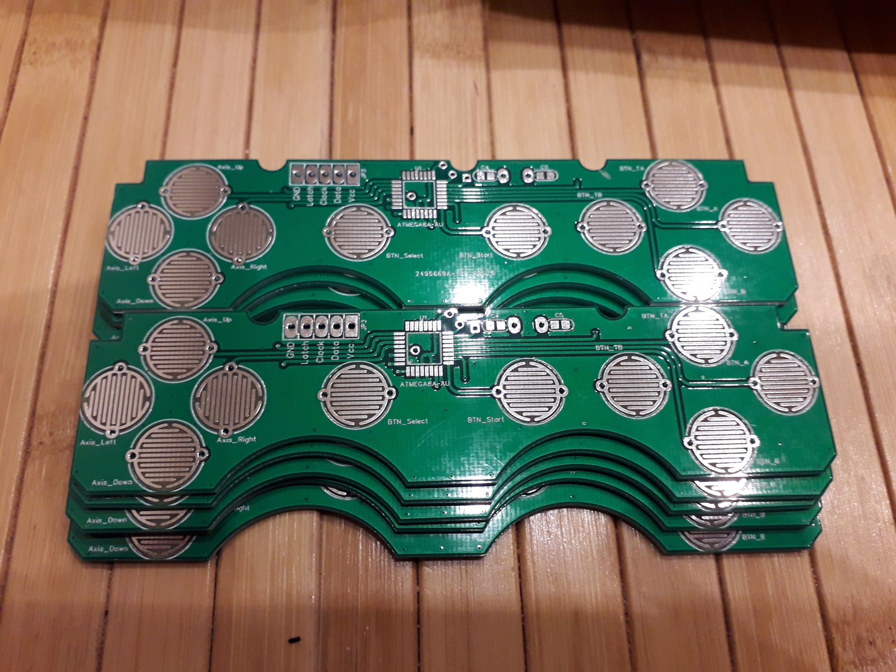
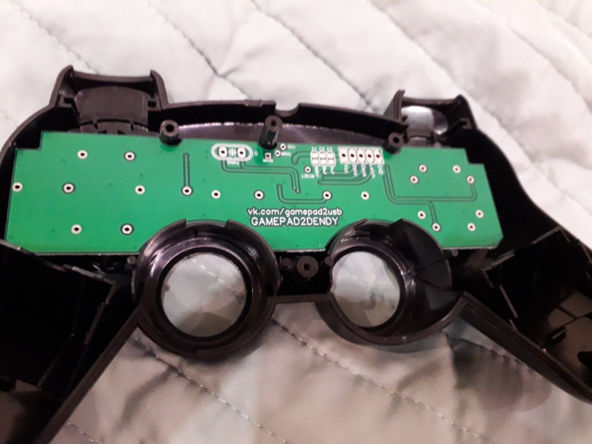

# SpeedLink Gamepad 2 Dendy
SpeedLink Gamepad 2 Dendy

Рад представить вам проект "SpeedLink Gamepad 2 Dendy"

Этот проект был разработан по просьбе Дружинина Андрея

Проект представляет схему, печатную плату, гербер файлы и прошивку джойстика для приставки Dendy/Famicom/NES.

На печатной плате расположен микроконтроллер ATMEGA8, который эмулирует джойстик вместе с турбо кнопками.

Данный проект распространяется свободно, 
но с указанием на первоисточник https://github.com/mleonid2000/gamepad_speedlink2dendy или https://vk.com/gamepad2usb

Обратная связь
lm2000@ya.ru
https://vk.com/gamepad2usb

Feedback
lm2000@ya.ru
https://vk.com/gamepad2usb
